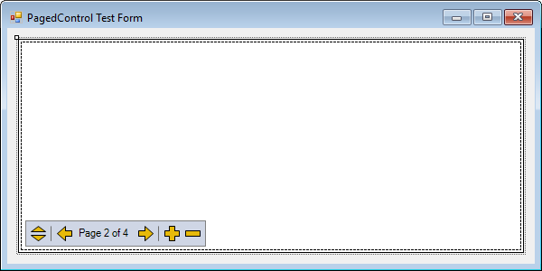

  

    

      <strong>PagedControl</strong>
    

    
a winforms pager control for housing child controls

    

      
      &nbsp;&nbsp;&nbsp;
      
    

    

	  @Api.Home
    

  

  

    

      

    

    
PagedControl in form designer

  

